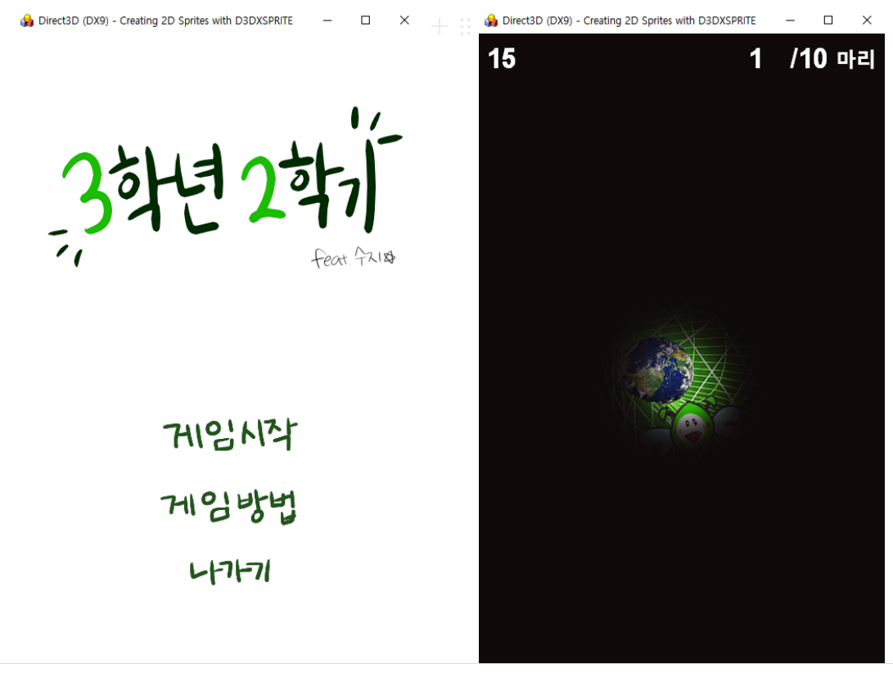

# DirectX 9.0 기반 게임

**개발:** C++, DirectX9.0, Win32
**업무포지션:** 대학생

## 👩‍🏫PROJECT 소개

Win32 API , DirectX 9.0 이해 바탕으로 미니게임 제작

🗓️ **작업기간** : 3학년 2학기

👨‍💻 **투입인원** : 1인개발

🙋‍♀️ **기여도 :** 100% 

📒 **주요 성과** 

- Direct3D 학습
- 3D 게임 프로그래밍 과목 A 획득

🌱 **스킬 및 사용툴**

 `DirectX 9.0` `visualStudio` 

## 🖌️더 알아보기

### 플레이 영상

[https://www.youtube.com/watch?v=0QqnpDbvyAQ&feature=youtu.be](https://www.youtube.com/watch?v=0QqnpDbvyAQ&feature=youtu.be)
